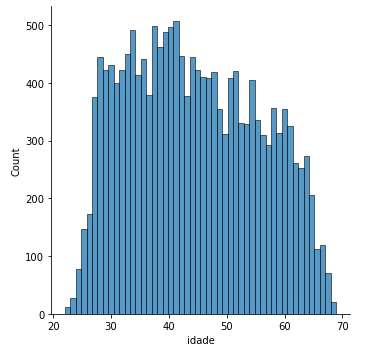
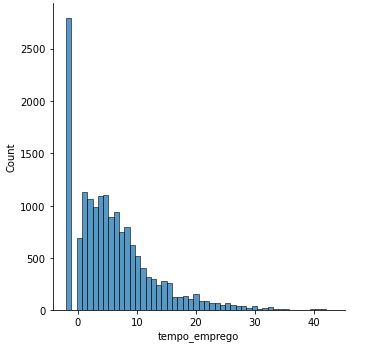

# Projeto de Concessão de Cartões de Crédito

## Etapa 1 CRISP-DM: Entendimento do Negócio

### Objetivos do Negócio

Este projeto tem como objetivo desenvolver um modelo preditivo para identificar o risco de inadimplência de proponentes de cartões de crédito. O problema foi publicado no Kaggle, uma plataforma que promove desafios de ciência de dados. Nosso objetivo é construir um modelo que auxilie o mutuário (o cliente) a tomar decisões informadas sobre crédito.

### Descrição do Problema

- **Objetivo do modelo**: Identificar o risco de inadimplência (definido pela ocorrência de um atraso maior ou igual a 90 dias em um horizonte de 12 meses) no momento da avaliação do crédito.
- **Público-alvo**: Proponentes de cartões de crédito.

### Situação do Negócio

Nesta etapa, avaliamos a situação do segmento de concessão de crédito para entender o tamanho do público, relevância, problemas presentes e todos os detalhes do processo gerador do fenômeno em questão.

## Etapa 2 CRISP-DM: Entendimento dos Dados

### Dicionário de Dados

A tabela de dados contém uma linha para cada cliente e uma coluna para cada variável armazenando as características dos clientes. Abaixo está o dicionário de dados:

| Variable Name             | Description                                    | Tipo    |
|---------------------------|------------------------------------------------|---------|
| sexo                      | M = 'Masculino'; F = 'Feminino'                | M/F     |
| posse_de_veiculo          | Y = 'possui'; N = 'não possui'                 | Y/N     |
| posse_de_imovel           | Y = 'possui'; N = 'não possui'                 | Y/N     |
| qtd_filhos                | Quantidade de filhos                           | inteiro |
| tipo_renda                | Tipo de renda (ex: assaliariado, autônomo etc) | texto   |
| educacao                  | Nível de educação (ex: secundário, superior)   | texto   |
| estado_civil              | Estado civil (ex: solteiro, casado etc)        | texto   |
| tipo_residencia           | Tipo de residência (ex: casa/apartamento)      | texto   |
| idade                     | Idade em anos                                  | inteiro |
| tempo_emprego             | Tempo de emprego em anos                       | inteiro |
| possui_celular            | Indica se possui celular (1 = sim, 0 = não)    | binária |
| possui_fone_comercial     | Indica se possui telefone comercial (1 = sim)  | binária |
| possui_fone               | Indica se possui telefone (1 = sim, 0 = não)   | binária |
| possui_email              | Indica se possui e-mail (1 = sim, 0 = não)     | binária |
| qt_pessoas_residencia     | Quantidade de pessoas na residência            | inteiro |
| mau                       | Indicadora de mau pagador (True = mau)         | binária |

### Carregando os Pacotes

```python
import pandas as pd
import seaborn as sns
import matplotlib.pyplot as plt
from sklearn.model_selection import train_test_split
from sklearn import metrics
from sklearn.ensemble import RandomForestClassifier
```


### Carregando os Dados
O comando pd.read_csv é um comando da biblioteca pandas (pd.) e carrega os dados do arquivo csv indicado para um objeto dataframe do pandas.

```
# Observe que demo01.csv está na mesma pasta que este notebook
# do contrário, seria necessário indicar a pasta no nome do arquivo

df = pd.read_csv('demo01.csv')
print ("Número de linhas e colunas da tabela: {}".format(df.shape))

df.head()
```

Número de linhas e colunas da tabela: (16650, 16)

| sexo | posse_de_veiculo | posse_de_imovel | qtd_filhos | tipo_renda         | educacao                       | estado_civil         | tipo_residencia    | idade     | tempo_emprego | possui_celular | possui_fone_comercial | possui_fone | possui_email | qt_pessoas_residencia | mau   |
|------|------------------|-----------------|------------|--------------------|-------------------------------|----------------------|--------------------|-----------|---------------|----------------|----------------------|-------------|--------------|-----------------------|-------|
| M    | Y                | Y               | 0          | Working            | Secondary / secondary special | Married              | House / apartment  | 58.832877 | 3.106849      | 1              | 0                    | 0           | 0            | 2.0                   | False |
| F    | N                | Y               | 0          | Commercial associate | Secondary / secondary special | Single / not married | House / apartment  | 52.356164 | 8.358904      | 1              | 0                    | 1           | 1            | 1.0                   | False |
| F    | N                | Y               | 0          | Commercial associate | Secondary / secondary special | Single / not married | House / apartment  | 52.356164 | 8.358904      | 1              | 0                    | 1           | 1            | 1.0                   | False |
| M    | Y                | Y               | 0          | Working            | Higher education              | Married              | House / apartment  | 46.224658 | 2.106849      | 1              | 1                    | 1           | 1            | 2.0                   | False |
| F    | Y                | N               | 0          | Working            | Incomplete higher             | Married              | House / apartment  | 29.230137 | 3.021918      | 1              | 0                    | 0           | 0            | 2.0                   | False |


### Entendimento dos dados - Univariada
Nesta etapa tipicamente avaliamos a distribuição de todas as variáveis. Nesta demonstração vamos ver a variável resposta e dois exemplos de univariada apenas. Mas sinta-se à vontade para tentar observar outras variáveis.

```
grafico_barras = df['mau'].value_counts().plot.bar()

print(df['mau'].value_counts())
print("\nTaxa de inadimplentes:")
print(df['mau'].mean())
```
False    16260
True       390
Name: mau, dtype: int64

Taxa de inadimplentes:

0.023423423423423424


```
# Análise univariada
var = "idade"
sns.displot(df, x = var, bins = 50)
plt.show()
```


```
plt.clf()
var = "tempo_emprego"

sns.displot(df, x = var, bins = 50)
plt.show()

<Figure size 432x288 with 0 Axes>
```


```
plt.clf()
var = "tempo_emprego"

df.loc[df[var]<0,var] = -2

sns.displot(df, x = var, bins = 50)
plt.show()
<Figure size 432x288 with 0 Axes>
```



### Entendimento dos dados - Bivariadas
Entender a alteração da inadimplência indicada pela variável resposta (AtrasoRelevante2anos) e as variáveis explicativas (demais). Para isto, vamos calcular a taxa de inadimplentes (qtd inadimplentes / total) para diferentes grupos definidos pelas variáveis explicativas.

```
var = 'idade'
cat_srs, bins = pd.qcut(df[var], 4, retbins=True)
g = df.groupby(cat_srs)
biv = g['mau'].mean()

ax = biv.plot.line()
ax.set_ylabel("Proporção de inadimplentes")
ticks = plt.xticks(range(len(biv.index.values)), biv.index.values, rotation = 90)
```


### Etapa 3 CRISP-DM: Preparação dos Dados

Nessa etapa realizamos tipicamente as seguintes operações com os dados:

- seleção Neste caso, os dados já estão pré-selecionados
- limpeza Precisaremos identificar e tratar dados faltantes
- construção Neste primeiro exercício não faremos construção de novas variáveis
- integração Temos apenas uma fonte de dados, não é necessário agregação
- formatação Os dados já se encontram em formatos úteis

Os dados já estão pré-selecionados, construídos e integrados, mas há dados faltantes que serão eliminados na próxima célula

```
metadata = pd.DataFrame(df.dtypes, columns = ['tipo'])

metadata['n_categorias'] = 0

for var in metadata.index:
    metadata.loc[var,'n_categorias'] = len(df.groupby([var]).size())
    
metadata
```

| Variável               | Tipo     | Número de Categorias |
|------------------------|----------|----------------------|
| sexo                   | object   | 2                    |
| posse_de_veiculo       | object   | 2                    |
| posse_de_imovel        | object   | 2                    |
| qtd_filhos             | int64    | 8                    |
| tipo_renda             | object   | 5                    |
| educacao               | object   | 5                    |
| estado_civil           | object   | 5                    |
| tipo_residencia        | object   | 6                    |
| idade                  | float64  | 5298                 |
| tempo_emprego          | float64  | 3005                 |
| possui_celular         | int64    | 1                    |
| possui_fone_comercial  | int64    | 2                    |
| possui_fone            | int64    | 2                    |
| possui_email           | int64    | 2                    |
| qt_pessoas_residencia  | float64  | 9                    |
| mau                    | bool     | 2                    |

```
def convert_dummy(df, feature,rank=0):
    pos = pd.get_dummies(df[feature], prefix=feature)
    mode = df[feature].value_counts().index[rank]
    biggest = feature + '_' + str(mode)
    pos.drop([biggest],axis=1,inplace=True)
    df.drop([feature],axis=1,inplace=True)
    df=df.join(pos)
    return df
```
```
for var in metadata[metadata['tipo'] == 'object'].index:
    df = convert_dummy(df, var)
```
```
df
```
| qtd_filhos | idade     | tempo_emprego | possui_celular | possui_fone_comercial | possui_fone | possui_email | qt_pessoas_residencia | mau   | sexo_M | ... | educacao_Lower secondary | estado_civil_Civil marriage | estado_civil_Separated | estado_civil_Single / not married | estado_civil_Widow | tipo_residencia_Co-op apartment | tipo_residencia_Municipal apartment | tipo_residencia_Office apartment | tipo_residencia_Rented apartment | tipo_residencia_With parents |
|------------|-----------|---------------|----------------|-----------------------|-------------|--------------|-----------------------|-------|--------|-----|--------------------------|-----------------------------|------------------------|-----------------------------------|-------------------|-------------------------------|-----------------------------------|------------------------------|--------------------------------|-----------------------------|
| 0          | 58.832877 | 3.106849      | 1              | 0                     | 0           | 0            | 2.0                   | False | 1      | ... | 0                        | 0                           | 0                      | 0                                 | 0                 | 0                             | 0                                 | 0                            | 0                              | 0                           |
| 0          | 52.356164 | 8.358904      | 1              | 0                     | 1           | 1            | 1.0                   | False | 0      | ... | 0                        | 0                           | 0                      | 1                                 | 0                 | 0                             | 0                                 | 0                            | 0                              | 0                           |
| 0          | 52.356164 | 8.358904      | 1              | 0                     | 1           | 1            | 1.0                   | False | 0      | ... | 0                        | 0                           | 0                      | 1                                 | 0                 | 0                             | 0                                 | 0                            | 0                              | 0                           |
| 0          | 46.224658 | 2.106849      | 1              | 1                     | 1           | 1            | 2.0                   | False | 1      | ... | 0                        | 0                           | 0                      | 0                                 | 0                 | 0                             | 0                                 | 0                            | 0                              | 0                           |
| 0          | 29.230137 | 3.021918      | 1              | 0                     | 0           | 0            | 2.0                   | False | 0      | ... | 0                        | 0                           | 0                      | 0                                 | 0                 | 0                             | 0                                 | 0                            | 0                              | 0                           |
| ...        | ...       | ...           | ...            | ...                   | ...         | ...          | ...                   | ...   | ...    | ... | ...                      | ...                         | ...                    | ...                               | ...               | ...                           | ...                               | ...                          | ...                            | ...                         |
| 0          | 54.109589 | 9.884932      | 1              | 0                     | 0           | 0            | 2.0                   | True  | 0      | ... | 0                        | 1                           | 0                      | 0                                 | 0                 | 0                             | 0                                 | 0                            | 0                              | 0                           |
| 0          | 43.389041 | 7.380822      | 1              | 1                     | 1           | 0            | 2.0                   | True  | 0      | ... | 0                        | 0                           | 0                      | 0                                 | 0                 | 0                             | 0                                 | 0                            | 0                              | 0                           |
| 0          | 30.005479 | 9.800000      | 1              | 1                     | 0           | 0            | 2.0                   | True  | 1      | ... | 0                        | 0                           | 0                      | 0                                 | 0                 | 0                             | 0                                 | 0                            | 0                              | 0                           |
| 0          | 30.005479 | 9.800000      | 1              | 1                     | 0           | 0            | 2.0                   | True  | 1      | ... | 0                        | 0                           | 0                      | 0                                 | 0                 | 0                             | 0                                 | 0                            | 0                              | 0                           |
| 0          | 33.936986 | 3.630137      | 1              | 0                     | 1           | 1            | 2.0                   | True  | 0      | ... | 0                        | 0                           | 0                      | 0                                 | 0                 | 0                             | 0                                 | 0                            | 0                              | 0                           |
| 

16650 rows x 29 columns

### Etapa 4 Crisp-DM: Modelagem
Nessa etapa que realizaremos a construção do modelo. Os passos típicos são:

- Selecionar a técnica de modelagem Utilizaremos a técnica de floresta aleatória (random forest), pois é uma técnica bastante versátil e robusta que captura bem padrões complexos nos dados, relativamente fácil de se usar e que costuma produzir excelentes resultados para uma classificação como estas. Vamos ver esse algoritmo em detalhes mais adiante no curso, mas pense nele por enquanto como uma regra complexa baseada nas variáveis explicativas que classifica o indivíduo como inadimplente ou não. Mais adiante no curso vamos extrair mais dessa técnica.
- Desenho do teste Antes de rodar o modelo precisamos construir um desenho do teste que será realizado. Para desenvolver um modelo como este, é considerado uma boa prática dividir a base em duas, uma chamada treinamento, onde o algoritmo 'aprende', e outra chamada teste, onde o algoritmo é avaliado. Essa prática fornece uma métrica de avaliação mais fidedigna do algoritmo, falaremos mais detalhes em lições futuras.
- Avaliação do modelo Faremos a avaliação do nosso modelo através do percentual de acerto, avaliando a classificação do modelo (inadimplente e não inadimplente) e comparando com o estado real armazenado na variável resposta (AtrasoRelevante2anos). Esse percentual de acerto é frequentemente chamado de acurácia (obs: nunca usar assertividade... assertivo não é aquele que acerta, e sim "adj.: em que o locutor declara algo, positivo ou negativo, do qual assume inteiramente a validade; declarativo." aCertivo está errado ;)

### Dividindo a base em treino e teste

```
# Tirando a v. resposta da base de treinamento
x = df.drop("mau",axis = 1)
y = df["mau"]

# Tirando ID da base de treinamento e teste
x_train, x_test, y_train, y_test = train_test_split(x, y)
```
```
x_train
```

| qtd_filhos | idade    | tempo_emprego | possui_celular | possui_fone_comercial | possui_fone | possui_email | qt_pessoas_residencia | sexo_M | posse_de_veiculo_Y | ... | educacao_Lower secondary | estado_civil_Civil marriage | estado_civil_Separated | estado_civil_Single / not married | estado_civil_Widow | tipo_residencia_Co-op apartment | tipo_residencia_Municipal apartment | tipo_residencia_Office apartment | tipo_residencia_Rented apartment | tipo_residencia_With parents |
|------------|----------|---------------|----------------|-----------------------|-------------|--------------|----------------------|--------|--------------------|-----|--------------------------|-------------------------------|------------------------|-----------------------------------|-------------------|--------------------------------|------------------------------------|---------------------------------|---------------------------------|--------------------------------|
| 14251      | 1        | 41.698630     | 0.789041       | 1                     | 0           | 0            | 0                    | 3.0    | 0                  | ... | 0                        | 0                             | 0                      | 0                                 | 0                 | 0                              | 0                                  | 0                               | 0                               | 0                              |
| 7102       | 0        | 27.865753     | 4.964384       | 1                     | 1           | 1            | 0                    | 1.0    | 1                  | ... | 0                        | 0                             | 0                      | 1                                 | 0                 | 0                              | 0                                  | 0                               | 0                               | 0                              |
| 7220       | 0        | 57.024658     | -10.000000     | 1                     | 0           | 0            | 0                    | 2.0    | 0                  | ... | 0                        | 0                             | 0                      | 0                                 | 0                 | 0                              | 0                                  | 0                               | 0                               | 0                              |
| 14803      | 0        | 55.183562     | 10.301370      | 1                     | 1           | 1            | 0                    | 2.0    | 0                  | ... | 0                        | 0                             | 0                      | 0                                 | 0                 | 0                              | 0                                  | 0                               | 0                               | 0                              |
| 15293      | 2        | 37.353425     | 17.380822      | 1                     | 1           | 0            | 0                    | 4.0    | 0                  | ... | 0                        | 1                             | 0                      | 0                                 | 0                 | 0                              | 0                                  | 0                               | 0                               | 0                              |
| ...        | ...      | ...           | ...            | ...                   | ...         | ...          | ...                  | ...    | ...                | ... | ...                      | ...                           | ...                    | ...                               | ...               | ...                            | ...                                | ...                             | ...                             | ...                            |
| 2736       | 0        | 34.200000     | 11.065753      | 1                     | 0           | 0            | 0                    | 2.0    | 1                  | ... | 0                        | 0                             | 0                      | 0                                 | 0                 | 0                              | 0                                  | 0                               | 0                               | 0                              |
| 14603      | 2        | 35.175342     | 12.558904      | 1                     | 0           | 0            | 0                    | 4.0    | 1                  | ... | 0                        | 0                             | 0                      | 0                                 | 0                 | 0                              | 0                                  | 0                               | 0                               | 0                              |
| 4592       | 1        | 52.536986     | 8.106849       | 1                     | 0           | 0            | 0                    | 2.0    | 0                  | ... | 0                        | 0                             | 1                      | 0                                 | 0                 | 0                              | 0                                  | 0                               | 0                               | 0                              |
| 11906      | 1        | 34.630137     | 1.093151       | 1                     | 0           | 0            | 0                    | 3.0    | 0                  | ... | 0                        | 1                             | 0                      | 0                                 | 0                 | 0                              | 0                                  | 0                               | 0                               | 0                              |
| 10323      | 0        | 62.994521     | -10.000000     | 1                     | 0           | 1            | 0                    | 2.0    | 0                  | ... | 0                        | 0                             | 0                      | 0                                 | 0                 | 0                              | 0                                  | 0                               | 0                               | 0                              |

12487 rows × 28 columns

### Rodando o modelo
A função RandomForestClassifier gera a estrutura da floresta aleatória, e o parâmetro n_estimator define o número de árvores na floresta. Normalmente a acurácia do modelo tende a aumentar com o número de árvores, pelo menos até um certo limite - e aumenta também o recurso computacional demandado. Você pode alterar esse parâmetro e verificar se a acurácia do seu modelo melhora - não recomendamos valores muito altos. Vá alterando aos poucos e percebendo como o tempo aumenta com os seus recursos. Não é necessário ir muito além de umas 100 árvores.

```
# Treinar uma Random Forest com 5 árvores

clf = RandomForestClassifier(n_estimators=3)
clf.fit(x_train,y_train)
```

RandomForestClassifier(n_estimators=3)

```
# Calculando a acuracia

y_pred = clf.predict(x_test)
acc = metrics.accuracy_score(y_test, y_pred)
print('Acurácia: {0:.2f}%'.format(acc*100))
```
Acurácia: 97.53%

```
# Matriz de confusão

tab = pd.crosstab(index = y_pred, columns = y_test)
print(tab[1][0]/(tab[1][0] + tab[0][0]))
print(tab[1][1]/(tab[1][1] + tab[0][1]))
tab
```

0.017522511559990267

0.42592592592592593

       | mau   | False | True |   
|  row_0 |  |   |   |
|--------|-------|-------|------|
|   | False | 4037  | 72   |
|        | True  | 31    | 23   |


### Etapa 5 Crisp-DM: Avaliação dos resultados
A etapa final do CRISP. Neste casp, a nossa avaliação termina com a acurácia. Mas em problemas futuros aprofundaremos mais - a ideia seria avaliar o impacto do uso do modelo no negócio, ou seja, o quanto o resultado financeiro melhora em detrimento da utilização do modelo.

Como um exemplo simples, considere que um cliente bom pagador deixa (em média) 5 'dinheiros' de lucro, e um mau pagador deixa (em média) 100 'dinheiros' de prejuízo.

de acordo com a matriz de confusão:

| Decisão   | lucro dos bons | lucro dos maus | total   |
|-----------|----------------|----------------|---------|
| Aprovador | 4037 x 5       | 72 x (-100)    | 12.985  |
| Reprovar  | 31 x 5         | 23 x (-100)    | -2.145  |

Estariamos evitando, portanto, um prejuízo de -2.145 'dinheiros' - o que na prática significa um aumento no lucro.

### Etapa 6 Crisp-DM: Implantação
Nessa etapa colocamos em uso o modelo desenvolvido, normalmente implementando o modelo desenvolvido em um motor de crédito que toma as decisões com algum nível de automação - tipicamente aprovando automaticamente clientes muito bons, negando automaticamente clientes muito ruins, e enviando os intermediários para análise manual.
